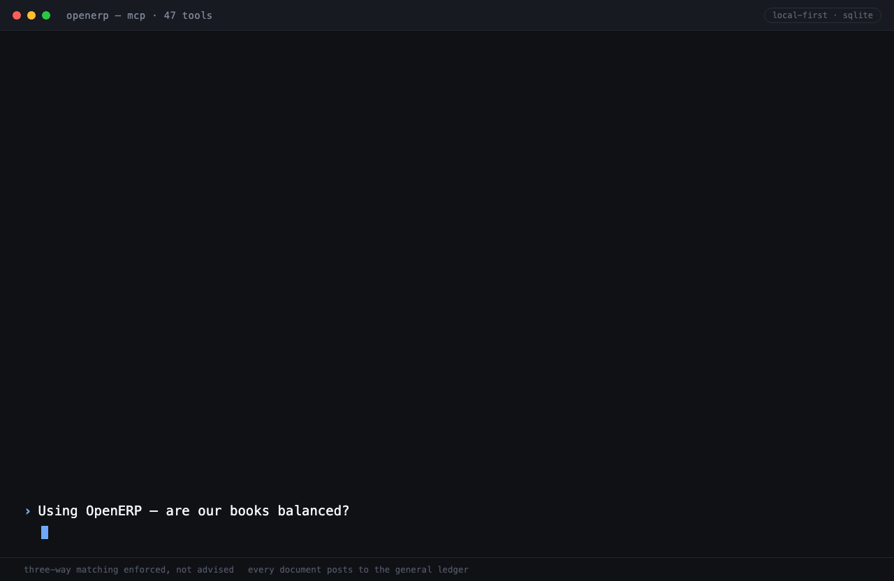

# OpenERP

**The ERP where the ledger is the source of truth and agents are the UI.**

Open-source, local-first ERP built for AI agents. Purchasing, inventory and
sales, every document posting to a double-entry general ledger.
SQLite-backed. MCP server with 47 tools. Three-way matching enforced, not advised.

[](LICENSE)
[](https://www.python.org/)
[](https://modelcontextprotocol.io)

Part of a family of local-first agent services:
[open-crm](https://github.com/Attri-Inc/open-crm) (memory) ·
[openwatch](https://github.com/Attri-Inc/openwatch) (observability) ·
[open-ledger](https://github.com/Attri-Inc/open-ledger) (money) ·
**openerp** (operations).

---

## See it in action



A purchase order raised, goods received short, and the vendor bill blocked by
three-way matching — every step posting to the general ledger, driven entirely
in conversation. Real output from the MCP server; reproduce it with
[docs/demo-script.md](docs/demo-script.md).

---

## Why OpenERP?

Odoo and ERPNext are excellent, and both were built for humans clicking through
forms — an agent driving them is automating a UI, not calling a system. Agent
frameworks, in the other direction, orchestrate well but have nowhere to put a
purchase order. OpenERP is the missing middle: an operational system of record
an agent can read *and* write, with the guarantees a spreadsheet can't offer.

| | **OpenERP** | **Odoo** | **ERPNext** | **NetSuite** |
|---|---|---|---|---|
| **Built for** | AI agents | Humans | Humans | Humans |
| **Interface** | REST-shaped services + MCP | Web UI + RPC | Web UI + REST | Web UI + SuiteTalk |
| **Ledger guarantees** | balance enforced in one write path | app-layer | app-layer | app-layer |
| **Corrections** | contra postings only, never edits | edit + repost | edit + repost | edit + repost |
| **Three-way match** | blocks the posting | configurable warning | configurable | configurable |
| **Drill-through** | every journal line names its document | ✓ | ✓ | ✓ |
| **MCP native** | 47 tools | ✗ | ✗ | ✗ |
| **Self-hosted** | SQLite, zero dependencies | Postgres required | MariaDB required | Cloud only |
| **License** | Apache 2.0 | LGPL + proprietary | GPLv3 | Proprietary |

---

## Quick Start

```bash
git clone https://github.com/Attri-Inc/open-erp.git
cd open-erp
python3 -m venv .venv && source .venv/bin/activate
pip install -e ".[dev]"
cp .env.example .env
python scripts/seed.py            # a small business, mid-cycle, on fresh books
```

The seed prints the state of the books it just created:

```
Seeded ./data/openerp.db
  Trial balance   $11,365.00 Dr / $11,365.00 Cr · balanced=True
  Balance sheet   assets $9,284.50 · balanced=True
  Stock value     $5,289.50 across 3 items
  GRNI (unbilled) $1,700.00
  Receivables     $1,230.00 · Payables $950.00
```

### Run with Docker

```bash
docker compose up --build
```

Data persists in the named volume `openerp-data`.

### Connect from Claude Desktop / Code

```bash
python run_mcp.py                 # stdio transport (default)
```

For Claude Code:
```bash
claude mcp add openerp -s user -- \
  /absolute/path/to/open-erp/.venv/bin/python \
  /absolute/path/to/open-erp/run_mcp.py
```

See [docs/claude-connector.md](docs/claude-connector.md) for the full setup.

---

## The two chains

Everything OpenERP does runs down one of two document chains, and each step
posts to the ledger as it happens.

**Procure-to-pay**

```
create_purchase_order → confirm_purchase_order → receive_goods
                      → post_vendor_bill → pay_vendor_bill

  receipt   Dr Inventory (or Expense, for services)   Cr GRNI
  bill      Dr GRNI                                   Cr Accounts payable
  payment   Dr Accounts payable                       Cr Bank
```

**Order-to-cash**

```
create_sales_order → confirm_sales_order → deliver_goods
                   → post_customer_invoice → receive_customer_payment

  delivery  Dr Cost of goods sold    Cr Inventory
  invoice   Dr Accounts receivable   Cr Revenue
  receipt   Dr Bank                  Cr Accounts receivable
```

GRNI — *goods received, not invoiced* — is the interim account that makes the
match auditable. Its balance **is** the list of things received but not billed,
and `get_unbilled_receipts` reads it back as a work queue.

---

## Three-way matching

A vendor bill is checked against the purchase order (price) and the goods
receipts (quantity) before it posts. A failed match raises; it does not warn.

```python
match_vendor_bill("PO-0004", lines=[{"line_no": 1, "quantity": 50, "unit_price_minor": 900}])
```

```json
{
  "po_number": "PO-0004",
  "matched": false,
  "discrepancies": [
    {"line_no": 1, "check": "price",
     "detail": "billed at $9.00, ordered at $7.00"}
  ]
}
```

Every discrepancy is reported at once, so a bill is fixed in one pass rather
than one round-trip per problem. `post_vendor_bill` runs the same check and
refuses to post — and because the whole document is one Unit of Work, a
rejected bill leaves no row, no stock move and no journal entry behind.

---

## Architecture

```
                ┌────────────────────────────────────────────┐
                │              SQLite database               │
                │  partners · items · warehouses · accounts  │
                │  purchase_orders · goods_receipts · bills  │
                │  sales_orders · deliveries · invoices      │
                │  stock_moves · journal_entries · audit_log │
                └─────────────────────┬──────────────────────┘
                                      │
                        one Unit of Work per document
                                      │
                                      ▼
                       MCP server (stdio / http :8793)
                       47 tools — reads + guarded writes
                                      │
                                      ▼
                          Claude Desktop, Claude Code,
                                agent frameworks
```

### Project structure

A layered architecture (SOLID): the transport, business rules, and persistence
are separated, and each depends only on the layer's abstraction — not its
implementation. Swapping SQLite for Postgres later touches only `repositories/`
and `container.py`.

```
src/
├── domain/          pure constants + typed error hierarchy (no I/O)
├── infrastructure/  Database connection, Unit of Work, id/clock helpers
├── repositories/    protocols.py  — narrow Reader/Writer contracts
│                    sqlite.py     — the only code that writes SQL (aiosqlite)
├── services/        posting    — the single door into the ledger
│                    masters    — partners, items, warehouses, accounts
│                    inventory  — stock moves + AVCO valuation
│                    purchasing — PO → receipt → bill → payment
│                    sales      — SO → delivery → invoice → receipt
│                    reports · audit · query
├── money.py         integer money/quantity arithmetic — no floats, anywhere
├── serialization.py response/error envelope helpers
├── container.py     composition root — wires SQLite repos into services
└── mcp_server.py    thin MCP transport adapter over the services
run_mcp.py           stdio entry point for Claude Desktop / Code
scripts/             seed.py (a running business) · schema.sql · smoke_test.py
tests/               the invariants: balance, valuation, matching, rollback
```

Querying is **raw parameterized SQL over `aiosqlite`** (no ORM); all SQL lives
behind the repository protocols, so services never see a query.

---

## Correctness

Five rules the code exists to enforce:

1. **Debits equal credits.** One write path — `PostingService.post` — and every
   document goes through it. An entry with fewer than two lines, an unbalanced
   entry, or a negative amount is refused.
2. **No floats.** Money is integer minor units (cents), quantity is integer
   milli-units. Every division rounds half-up with integer arithmetic.
3. **Postings are immutable.** Corrections are contra entries via
   `reverse_entry`. A reversed entry stays in the books and the contra cancels
   it — which is why balance queries deliberately count both.
4. **Quantity and value move together.** A stock move and its valuation shift
   are one statement, so on-hand and stock value cannot drift. The test suite
   asserts stock valuation equals the Inventory account, every run.
5. **A document is all-or-nothing.** The order row, its stock moves, its journal
   entry and its audit row commit in one transaction, or none of them do.

```bash
pytest -q                          # 37 tests over those invariants
python scripts/smoke_test.py       # the same guarantees through the MCP tools
```

---

## Tools

| Group | Tools |
|---|---|
| **Master data** | `list_partners` `get_partner` `create_partner` `list_items` `get_item` `create_item` `list_warehouses` `create_warehouse` |
| **Ledger** | `list_accounts` `get_balance` `get_account_ledger` `create_account` `get_journal_entry` `search_journal` `post_journal_entry` `reverse_entry` |
| **Procure-to-pay** | `create_purchase_order` `confirm_purchase_order` `get_purchase_order` `search_purchase_orders` `receive_goods` `match_vendor_bill` `post_vendor_bill` `get_vendor_bill` `search_vendor_bills` `pay_vendor_bill` |
| **Order-to-cash** | `create_sales_order` `confirm_sales_order` `get_sales_order` `search_sales_orders` `deliver_goods` `post_customer_invoice` `get_customer_invoice` `search_customer_invoices` `receive_customer_payment` |
| **Inventory** | `get_stock_on_hand` `get_stock_valuation` `list_stock_moves` `adjust_stock` |
| **Reports** | `get_trial_balance` `get_profit_and_loss` `get_balance_sheet` `get_ar_aging` `get_ap_aging` `get_unbilled_receipts` |
| **Audit & query** | `get_audit_log` `run_query` |

Partners, items, warehouses and accounts resolve by id, code/sku **or name**, so
an agent passes `"Acme"` or `"SKU-100"` and never handles an id.

---

## Configuration

| Variable | Default | Purpose |
|---|---|---|
| `OPENERP_DB` | `./data/openerp.db` | SQLite database path |
| `MCP_TRANSPORT` | `stdio` | `stdio`, `sse`, or `streamable-http` |
| `MCP_HOST` | `127.0.0.1` | Bind address for the HTTP transports |
| `MCP_PORT` | `8793` | Port for the HTTP transports |

Posting rules bind to account **roles**, not codes — `bank`, `ar`, `ap`,
`inventory`, `grni`, `cogs`, `revenue`, `expense`, `equity`. Renumber the chart
of accounts freely; map the roles once with `create_account(role=...)` and no
service changes.

---

## What this is not (v0.1)

- Not multi-currency. One base currency per deployment.
- Not a tax engine. Line totals are quantity × price; no tax codes yet.
- Not manufacturing. No BOM, routing or work orders.
- Not multi-tenant. Each deployment is one company's books.
- Not fiscal-period close. Any date is postable.

See [VISION.md](VISION.md) for where each of those lands on the roadmap.

## License

Apache 2.0
